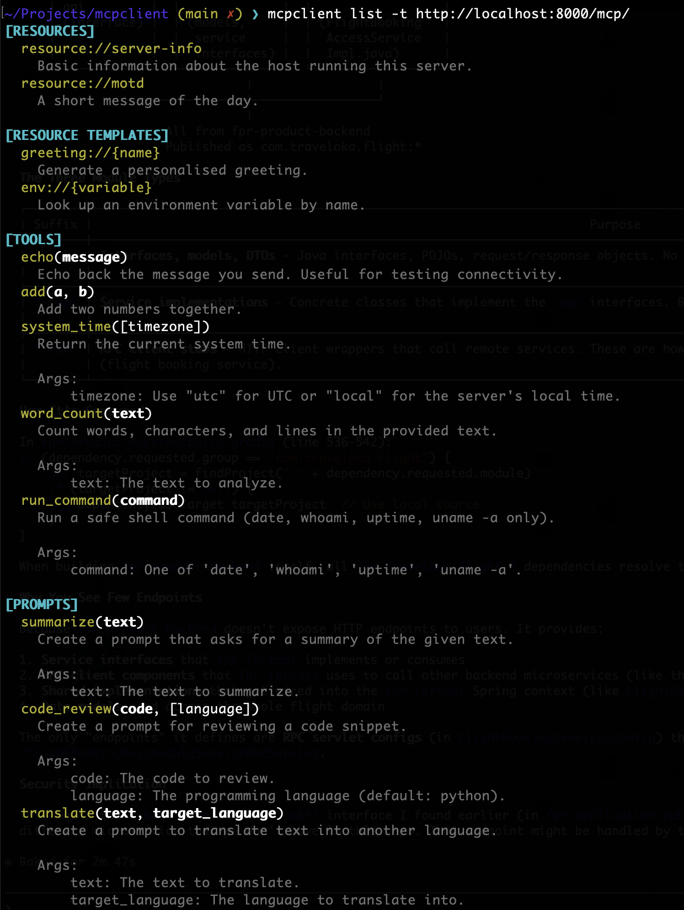
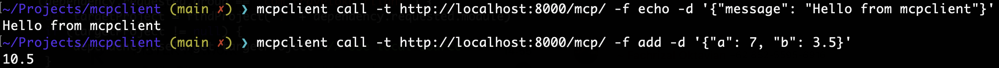
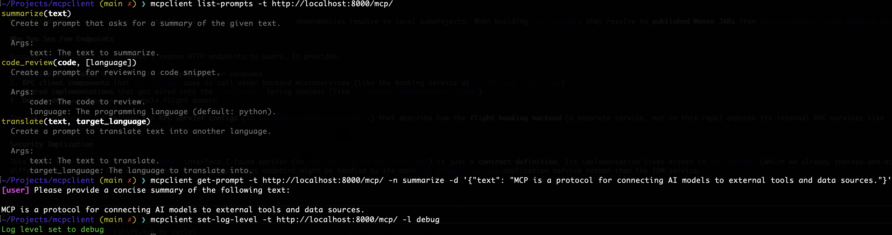

# mcpclient

A command-line client for MCP (Model Context Protocol) servers.

Enumerate and interact with MCP servers from the command line. List resources, templates, tools, and prompts, read resource content, call tools, render prompts, and manage roots and logging. Coloured output and a consistent flag style across all commands.

Supports three MCP transports: **Streamable HTTP**, **SSE**, and **stdio**.



---

## Install

Requires **Python 3.10+**.

```bash
git clone https://github.com/Slickerius/mcpclient.git
cd mcpclient
pip install -e .
```

---

## Commands

### `list` - enumerate all capabilities

```bash
mcpclient list -t http://localhost:8000/mcp/
```

Lists resources, resource templates, tools, and prompts with coloured output.

Example output:

```
[RESOURCES]
  resource://server-info
    Basic information about the host running this server.
  resource://motd
    A short message of the day.

[RESOURCE TEMPLATES]
  greeting://{name}
    Generate a personalised greeting.
  env://{variable}
    Look up an environment variable by name.

[TOOLS]
  echo(message)
    Echo back the message you send. Useful for testing connectivity.
  add(a, b)
    Add two numbers together.
  system_time([timezone])
    Return the current system time.

    Args:
        timezone: Use "utc" for UTC or "local" for the server's local time.
  run_command(command)
    Run a safe shell command (date, whoami, uptime, uname -a only).

    Args:
        command: One of 'date', 'whoami', 'uptime', 'uname -a'.

[PROMPTS]
  summarize(text)
    Create a prompt that asks for a summary of the given text.
  code_review(code, [language])
    Create a prompt for reviewing a code snippet.
  translate(text, target_language)
    Create a prompt to translate text into another language.
```

---

### `read` - read a resource

```bash
mcpclient read -t http://localhost:8000/mcp/ -r resource://logs
mcpclient read -t http://localhost:8000/mcp/ -r price://banana
```

Fetches the content of a resource by URI. Spaces and special characters in URIs must be percent-encoded (`%20` for space). The server decodes them before passing the value to the handler.


---

### `call` - call a tool

```bash
mcpclient call -t http://localhost:8000/mcp/ -f list_users
mcpclient call -t http://localhost:8000/mcp/ -f execute_server_command -d '{"command": "date"}'
mcpclient call -t http://localhost:8000/mcp/ -f fetch_data -d '{"url": "http://example.com"}'
```

Arguments are passed as a JSON object with `-d` (default: `{}`).



---

### `list-prompts` - list prompt templates

```bash
mcpclient list-prompts -t http://localhost:8000/mcp/
```

Lists server-side prompt templates with names, arguments, and descriptions. Required arguments are shown in **bold**, optional ones in `[brackets]`.

---

### `get-prompt` - render a prompt

```bash
mcpclient get-prompt -t http://localhost:8000/mcp/ -n summarize -d '{"doc_id": "42"}'
```

Renders a named prompt template with the supplied arguments and prints each message with its role.

---

### `set-roots` - advertise root URIs to the server

```bash
mcpclient set-roots -t http://localhost:8000/mcp/ -r file:///home/user/project
mcpclient set-roots -t http://localhost:8000/mcp/ -r file:///home/user/project -r file:///tmp
```

Declares the filesystem roots the client is working within (client → server direction). The `-r` flag is repeatable for multiple roots.

---

### `set-log-level` - change server log verbosity

```bash
mcpclient set-log-level -t http://localhost:8000/mcp/ -l debug
```

Asks the server to change its logging verbosity. Valid levels: `debug`, `info`, `warning`, `error`, `critical`.



---

## Transports

mcpclient supports three MCP transport protocols. The transport is selected automatically based on the flags you use.

### Streamable HTTP (default)

Connect to a remote MCP server over HTTP. This is the default when using `-t` with a URL.

```bash
mcpclient list -t http://localhost:8000/mcp/
```

### SSE (Server-Sent Events)

Connect to a remote MCP server using the older SSE transport. Use the `--sse` flag to enable it.

```bash
mcpclient list -t http://localhost:8000/sse --sse
mcpclient list -t http://localhost:8000/events --sse
```

### stdio (local subprocess)

Spawn a local MCP server process and communicate over stdin/stdout. Use `-c` with the full shell command to launch.

```bash
mcpclient list -c "python my_server.py"
mcpclient call -c "npx -y @modelcontextprotocol/server-filesystem /tmp" -f list_allowed_directories
```

The `-c` and `-t` flags are mutually exclusive. HTTP-specific options (`-u`, `-p`, `-H`) cannot be used with `-c`.

---

## Options reference

| Command | Flag | Short | Description |
|---------|------|-------|-------------|
| all | `--target` | `-t` | MCP server URL (Streamable HTTP or SSE) |
| all | `--command` | `-c` | Stdio command to spawn (e.g. `"python server.py"`) |
| all | `--sse` | | Force SSE transport instead of Streamable HTTP |
| all | `--user` | `-u` | HTTP Basic Auth username |
| all | `--password` | `-p` | HTTP Basic Auth password |
| all | `--header` | `-H` | Extra HTTP header as Name:Value (repeatable) |
| `read` | `--resource` | `-r` | Resource URI (percent-encode special characters) |
| `call` | `--function` | `-f` | Tool name |
| `call` | `--data` | `-d` | Tool arguments as JSON (default `{}`) |
| `get-prompt` | `--name` | `-n` | Prompt template name |
| `get-prompt` | `--data` | `-d` | Prompt arguments as JSON (default `{}`) |
| `set-roots` | `--root` | `-r` | Root URI to advertise (repeatable) |
| `set-log-level` | `--level` | `-l` | Log level (`debug`/`info`/`warning`/`error`/`critical`) |

---

## Exit codes

| Code | Meaning |
|------|---------|
| `0` | Success |
| `1` | Error (connection failure, tool error, bad JSON, etc.) |
